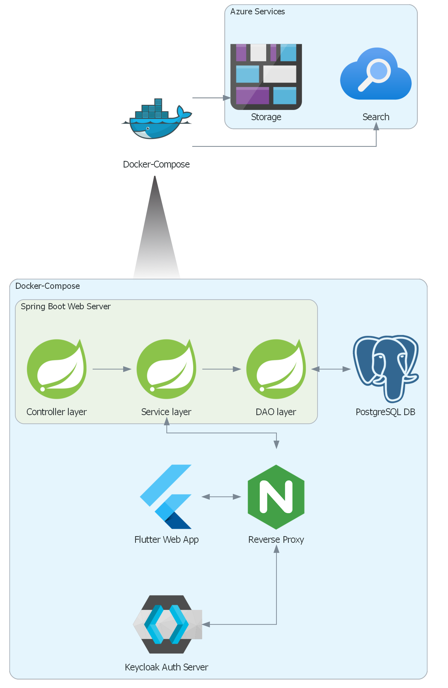
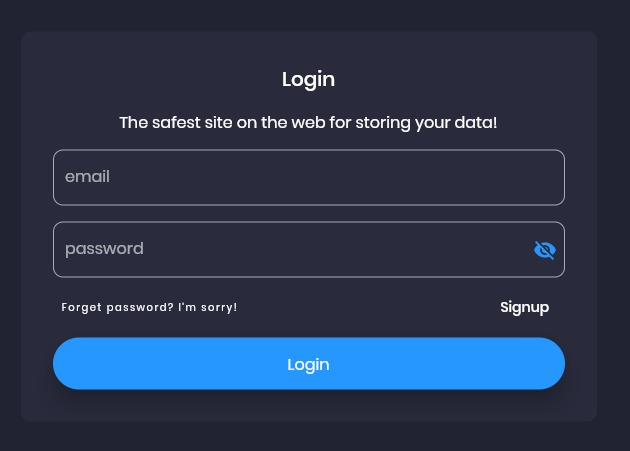
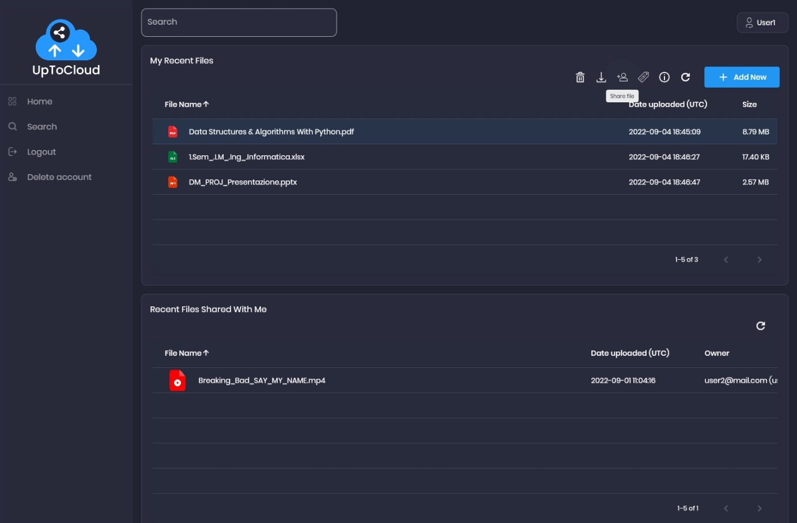
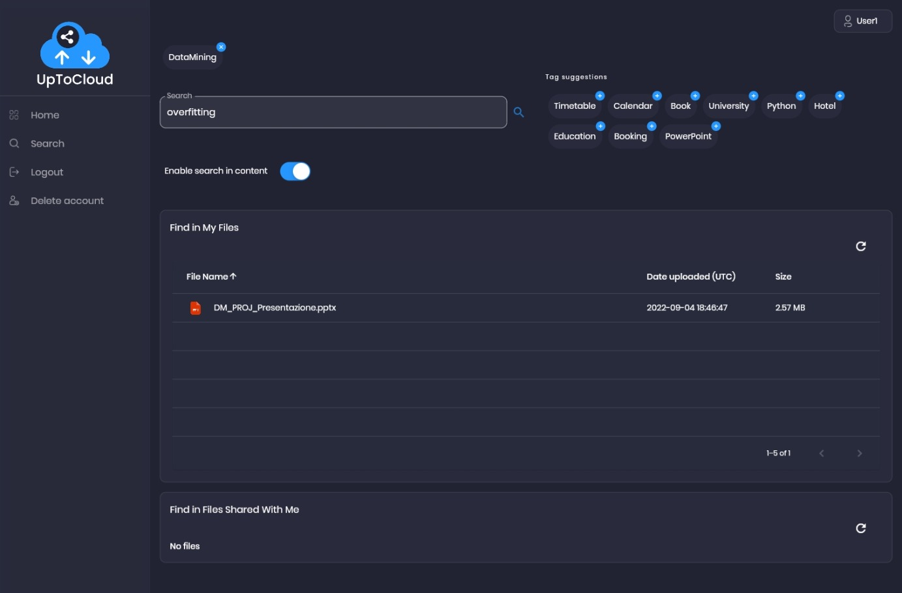
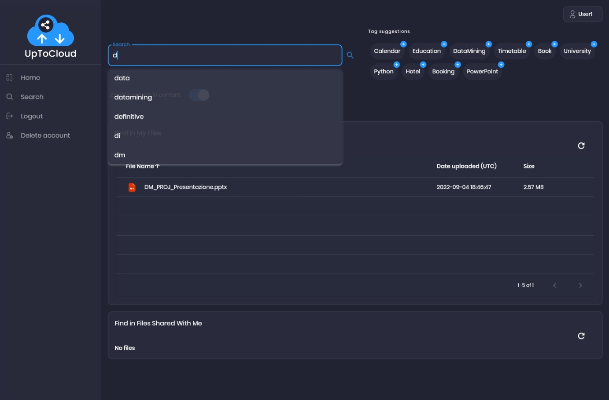
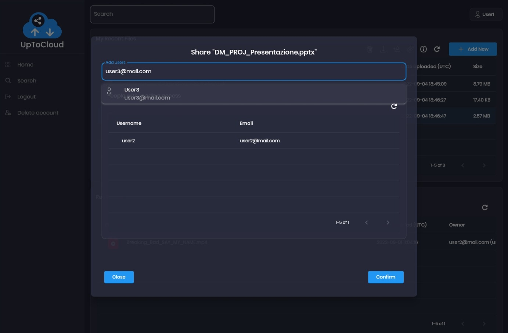
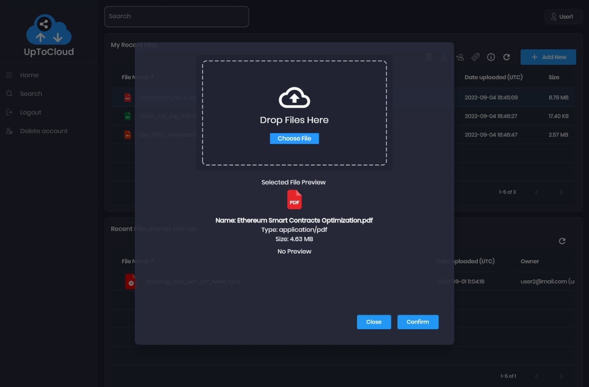
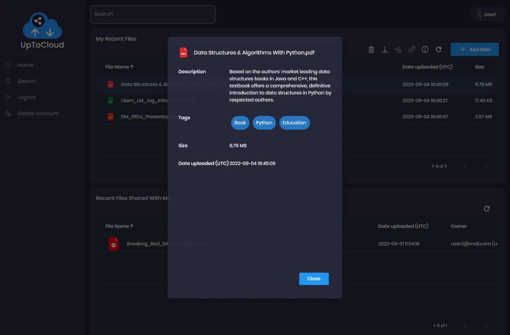

# Distributed systems and Cloud computing Course Project

## Project description
Built a file-sharing Web Application, based on Azure Cloud Services. Managed access permissions and implemented search functionalities.

## Architecture
Azure Cloud Services used:
 - Azure Blob Storage
 - Azure Cogntivie Search
 - Azure App Service

## Web-App Demo

